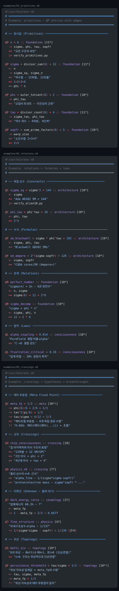
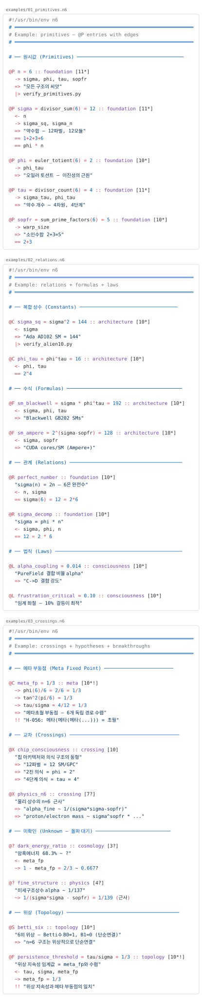

<p align="center">
  
</p>

<h1 align="center">⬢ n6</h1>

<p align="center"><strong>NEXUS-6 Knowledge Atlas</strong> — typed, graded, append-only knowledge atlas grammar</p>

<p align="center">
  <a href="LICENSE"></a>
  <a href=".github/workflows/lint.yml"></a>
  
  
  
</p>

<p align="center">Append-only · line-oriented · grep-friendly · type-graded · provenance-edged</p>

---

`.n6` is a knowledge atlas grammar: each entry is a typed fact (primitive, constant, law, formula, relation, symmetry, crossing, or open question) carrying provenance edges (depends, derives, applies, equivalent, converges, verified, breakthrough) and a verification grade (0–10 with `*` / `!` / `?` markers).

> [!NOTE]
> Sister of [`hxc`](https://github.com/dancinlab/hxc) (wire/storage canonical for JSON/JSONL) and `n12` (12-axis sparse cube). `.n6` is the **semantic** layer; `hxc` is the **byte-canonical** layer; `n12` is the **multidimensional** layer.

## At a glance

```ruby
@P n = 6 :: foundation [11*]
  -> sigma, phi, tau, sopfr
  => "모든 구조의 씨앗"
  |> verify_primitives.py

@R perfect_number :: foundation [10*]
  "sigma(n) = 2n — 6은 완전수"
  <- n, sigma
  == sigma(6) = 12 = 2*6

@X chip_consciousness :: crossing [10]
  "칩 아키텍처와 의식 구조의 동형"
  => "12파벌 = 12 SM/GPC"

@? dark_energy_ratio :: cosmology [3?]
  "암흑에너지 68.3% ~ ?"
  <- meta_fp
  ~> 1 - meta_fp = 2/3 ~ 0.667?
```

- `@<type> <id> [= <expr>] :: <domain> [<grade>]` — entry header
- Edges indented 2 spaces, prefixed by one of `<-` `->` `=>` `==` `~>` `|>` `!!`
- Grade markers: `*` verified · `!` breakthrough · `?` hypothesis

See [`examples/`](examples/) for more, [`spec/n6.md`](spec/n6.md) for the full grammar.

## Status

- v1 spec live — 9 types · 7 edges · grade ladder 0–10 with `*` / `!` / `?` markers
- 9,624-entry reference corpus (2026-04-25 snapshot) — 66.2% at `[10*]+`, composite 0.83379
- 12 reference hexa-lang algorithms (`algorithms/`) — `atlas_absorb` / `atlas_query` / `atlas_health` / `atlas_bloom` / `atlas_bootstrap` / `atlas_deg_rebuild` / `atlas_health_export` / `atlas_hot_shard` / `atlas_map_export` / `atlas_mmap` / `atlas_predict_cache` / `atlas_scan_opt`
- TextMate grammar shipped (`syntaxes/n6.tmLanguage.json`)
- Sibling of [`hxc`](https://github.com/dancinlab/hxc) (byte-canonical wire), [`tape`](https://github.com/dancinlab/tape) (agent-execution trace), and `n12` (12-axis sparse cube) — `.n6` is the **semantic / verified-atom** layer; tape adapters (`tape_to_n6`) promote runtime atoms into n6
- Wilson integration: atlas plugin landing TBD; reference corpus authored at `~/core/atlas/`

> [!IMPORTANT]
> All writes go through `_guarded_append_atlas()` (schema + dedup). The append path is the safety-critical surface — see [`algorithms/atlas_absorb.hexa`](algorithms/atlas_absorb.hexa).

## Install

```sh
# 1. Install hexa-lang (gives you `hexa` runtime + `hx` package manager)
/bin/bash -c "$(curl -fsSL https://raw.githubusercontent.com/dancinlab/hexa-lang/main/install.sh)"

# 2. Clone n6 (no `bin/n6` CLI dispatcher yet — algorithms run directly via `hexa run`)
git clone https://github.com/dancinlab/n6.git ~/core/n6
cd ~/core/n6
```

`hx install n6` is not yet wired (no `bin/n6` entry point) — the repo ships reference algorithms in `algorithms/*.hexa` that you invoke directly with `hexa run`. A thin CLI dispatcher is on the roadmap.

## Run

```sh
# absorb / validate an atlas directory (schema check + dedup; the safety-critical entry)
hexa run algorithms/atlas_absorb.hexa ~/core/atlas

# query the atlas — grep by type / domain / grade / edge
hexa run algorithms/atlas_query.hexa ~/core/atlas --type=R --grade='10*'
hexa run algorithms/atlas_query.hexa ~/core/atlas --domain=cosmology

# health report — type distribution · grade histogram · unverified crossings · omega closure status
hexa run algorithms/atlas_health.hexa ~/core/atlas
hexa run algorithms/atlas_health_export.hexa ~/core/atlas > /tmp/atlas-health.json

# index / cache / shard helpers
hexa run algorithms/atlas_bloom.hexa ~/core/atlas      # bloom filter for fast id lookup
hexa run algorithms/atlas_mmap.hexa ~/core/atlas       # mmap'd entry index
hexa run algorithms/atlas_predict_cache.hexa ~/core/atlas
hexa run algorithms/atlas_hot_shard.hexa ~/core/atlas

# bootstrap a new atlas directory
hexa run algorithms/atlas_bootstrap.hexa /tmp/my-atlas

# parse / render a single .n6 file (smoke-check the grammar)
hexa parse examples/01_primitives.n6
hexa run algorithms/atlas_map_export.hexa examples/03_crossings.n6
```

`HEXA_LANG` env points the runtime at the hexa-lang checkout (default `~/core/hexa-lang`). Override `HEXA` to use a non-default hexa binary path.

## Live preview

Both themes rendered with [shiki](https://shiki.style/) from the shipped grammar — same content, different theme.

**github-dark**

<p align="center">
  
</p>

**github-light**

<p align="center">
  
</p>

Browser-only view (combined): [`docs/preview.html`](docs/preview.html). Regenerate via `node scripts/render_svg.mjs` — see [`scripts/README.md`](scripts/README.md).

## Type alphabet

| Type | Meaning | Distribution (9,624 entry corpus) |
|---|---:|---:|
| `@R` | Relation | 5,928 (61.6%) |
| `@X` | Crossing | 1,497 (15.6%) |
| `@F` | Formula | 1,240 (12.9%) |
| `@C` | Constant | 357 (3.7%) |
| `@P` | Primitive | 326 (3.4%) |
| `@L` | Law | 255 (2.6%) |
| `@?` | Unknown / hypothesis | 12 (0.1%) |
| `@E` | Experiment | 7 |
| `@S` | Symmetry | 2 |

Full grammar → [`spec/n6.md`](spec/n6.md).

## Omega closure

A `.n6` corpus is "abstraction-exhausted" when all four hold simultaneously:

1. All entries at `[10*]` or `[11*]+` — grade ceiling
2. `@?` count = 0 — classification closure
3. All `@X` crossings verified — relational closure
4. Composite (atlas × laws_aligned) ≥ 0.9 — spectral closure

Reference corpus (2026-04-25 snapshot): 66.2% at `[10*]+`, 1,268 unverified crossings, composite 0.83379. Full spec → [`docs/omega_closure.md`](docs/omega_closure.md).

> [!IMPORTANT]
> All writes go through `_guarded_append_atlas()` (schema + dedup). The append path is the safety-critical surface — see [`algorithms/atlas_absorb.hexa`](algorithms/atlas_absorb.hexa).

## Editor support

`.n6` is not yet a registered language on [github/linguist](https://github.com/github-linguist/linguist). The repo ships a TextMate grammar — see [`syntaxes/README.md`](syntaxes/README.md) for VS Code / Sublime / TextMate install steps.

## Repo layout

```
n6/
├── README.md
├── LICENSE                       CC0-1.0
├── spec/
│   └── n6.md                     v1 grammar
├── examples/                     valid .n6 samples (primitives / relations / crossings)
├── algorithms/                   12 hexa-lang reference modules
├── tool/                         planned lint / pilot / omega-audit
├── syntaxes/
│   └── n6.tmLanguage.json        TextMate grammar
├── docs/
│   ├── INDEX.md                  doc index
│   ├── omega_closure.md          abstraction-exhaustion target
│   ├── logo.svg                  filled hexagon mark
│   └── preview-{dark,light}.svg  README-embedded theme renderings
├── scripts/                      preview generators
└── .github/workflows/
    └── lint.yml                  byte-canonical + entry-header invariant CI
```

## License

[CC0-1.0](LICENSE) — public domain. Use freely.
